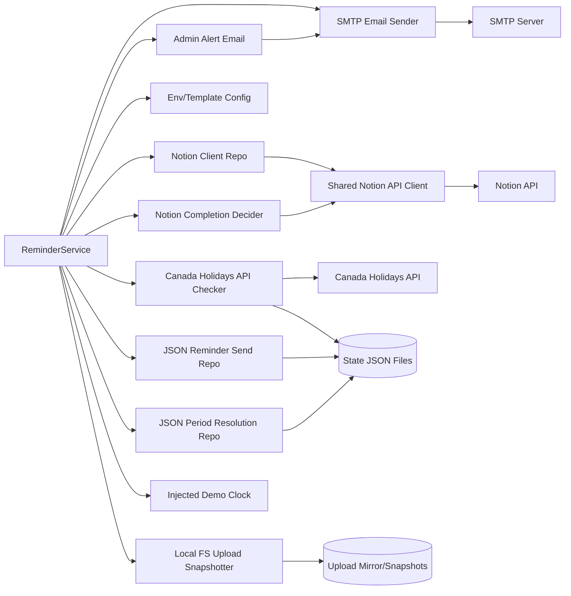

# Demo Service Wiring

```mermaid
flowchart LR
  Service[ReminderService]

  EmailSMTP[SMTP Email Sender]
  ClientNotion[Notion Client Repo]
  CompletionNotion[Notion Completion Decider]
  ConfigEnv[Env/Template Config]
  HolidayCanada[Canada Holidays API Checker]
  SendJSON[JSON Reminder Send Repo]
  PeriodJSON[JSON Period Resolution Repo]
  AdminEmail[Admin Alert Email]
  UploadSnapshot[Local FS Upload Snapshotter]
  Clock[Injected Demo Clock]

  NotionAPI[Shared Notion API Client]
  SMTP[SMTP Server]
  Notion[Notion API]
  HolidayAPI[Canada Holidays API]
  StateFiles[(State JSON Files)]
  UploadFiles[(Upload Mirror/Snapshots)]

  Service --> EmailSMTP
  Service --> ClientNotion
  Service --> ConfigEnv
  Service --> CompletionNotion
  Service --> HolidayCanada
  Service --> SendJSON
  Service --> PeriodJSON
  Service --> AdminEmail
  Service --> Clock
  Service --> UploadSnapshot

  ClientNotion --> NotionAPI
  CompletionNotion --> NotionAPI
  NotionAPI --> Notion

  EmailSMTP --> SMTP
  AdminEmail --> EmailSMTP

  HolidayCanada --> HolidayAPI
  HolidayCanada --> StateFiles
  SendJSON --> StateFiles
  PeriodJSON --> StateFiles
  UploadSnapshot --> UploadFiles
```
